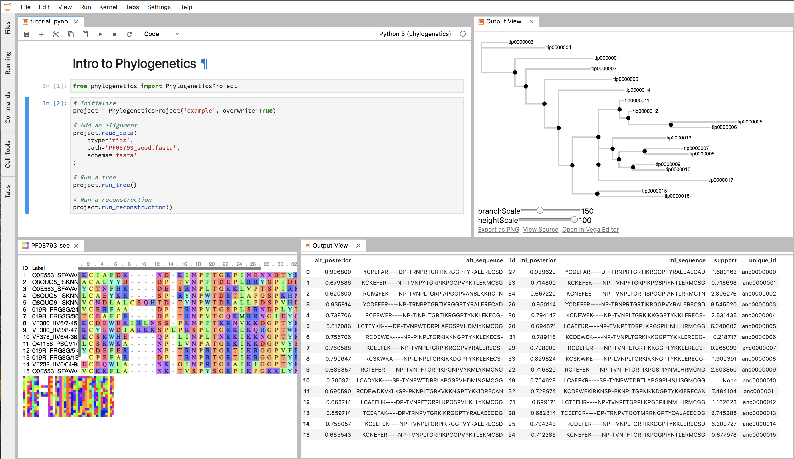

Phylogenetics
=============

**A Python API for interactive phylogenetics**

Phylogenetics is a minimal Python API that makes phylogenetics interactive and
reproducible. It's main purpose is to take you from a multiple sequence alignment
to a set of ancestral sequences.

Basic Example
-------------

Initialize a ``PhylogeneticsProject`` object, add your alignment, and analyze
your tree all in the Jupyter notebook.

.. code-block:: python

  # Imports
  from phylogenetics import PhylogeneticsProject

  # Initialize a project class
  project = PhylogeneticsProject(project_dir='project')

  # Add tips data or alignment.
  project.read_data(dtype='tips', path='alignment.fasta', schema='fasta')

  # Compute phylogenetic tree and ancestors.
  project.compute_tree()
  project.compute_ancestors()

Installation
------------

Install from PyPi:

.. code-block::

  pip install phylogenetics

To install a development version:

.. code-block::

  git clone https://github.com/Zsailer/phylogenetics
  cd phylogenetics
  pip install -e .

Dependencies
---------------

Phylogenetics manages phylogenetics data. Currently, it doesn't do any of the phylogenetic calculations itself. For this, it uses wraps external tools like:

3. PhyML: for building maximum likelihood trees. (http://www.atgc-montpellier.fr/phyml/)
4. PAML: for reconstructing ancestors. http://abacus.gene.ucl.ac.uk/software/paml.html)

Phylogenetics is built on top of following python stack:

1. Pandas
2. Biopython
3. DendroPy
4. ToyTree
5. PhyloPandas
6. PyASR
