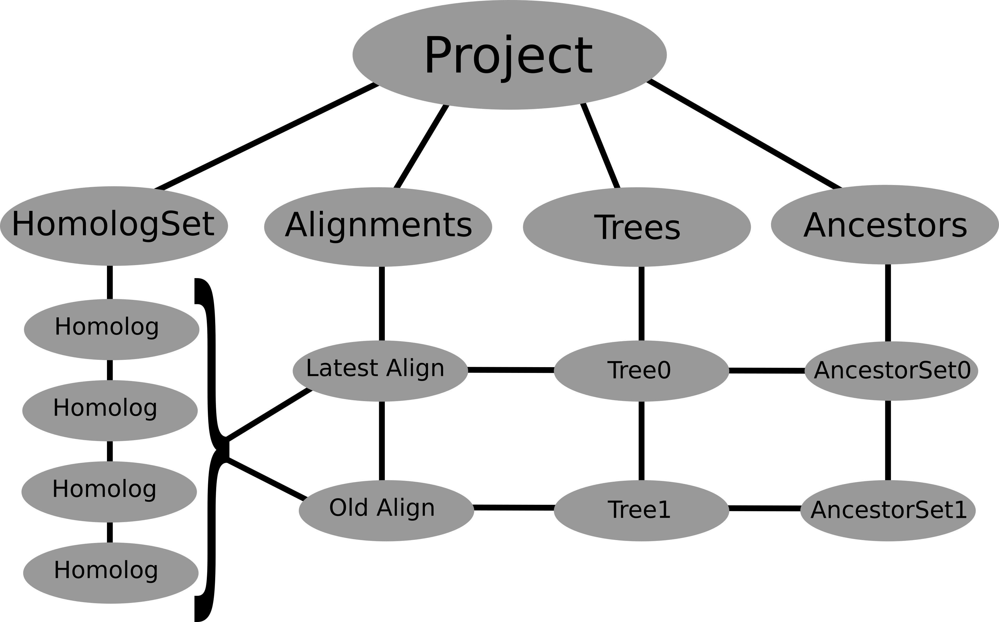

Project Class
=============

The ``project`` class provides a single, persisent object that walks you through
a phylogenetics pipeline. As you construct a project, new methods and attributes
become accessible to analyze your sequence data.

This object also acts as a container for all your data, and saves its current state
at each step. (To see what a saved project looks like, checkout the the `Metadata page`_.)

.. _Metadata page:

Contents of this page:

* `Project design`_
* `Basic Usage`_

Project design
--------------

The diagram below shows the architecture of the ``Project`` class and its API.

Each ``HandlerContainer`` object inside the Project class attaches a set of useful methods for analyzing
each type of data. The API for these HandlerContainers live in project
class and are accessible as subobjects. The project class creates the links, shown in the figure above,
if they exist in the Container's metadata. Links aid in mapping objects throughout
the API. For example, a Sequence object might be linked to a taxon on a Tree object, or an
AncestorSequnce might be linked to a node on a Tree object.

Without links, all objects are independent. This makes it possible to start at any
step in the project class. For example, if you already have a list of aligned sequences,
you can skip building a ``SequenceList``, begin with an ``AlignmentList``, and continue building a ``Tree``.

Basic Usage
-----------
There a few ways in which you can construct a phylogenetics Project.

- Start fresh
    1. initialize a project object::

        project = phylogenetics.Project()

    2. download a list of accession ids::

        project.download(accessions_list)

    3. run pipeline::

        project.cluster()
        project.align()
        project.tree()
        project.reconstruct()

- Start with existing `phylogenetics` objects/data

    1. Initialize project class with other objects given as arguments::

        project = phylogenetics.Project(
            HomologSet,
            Alignment,
        )

    2. Continue through pipeline

    3. Or add separate objects later.::

        project = phylogenetics.add(Tree)

- Load existing phylogenetics file from file.

    Each action in the phylogenetics package saves a copy to disk by default.::

        project.load("project-#####.pickle")

- Read phylogenetic data from files into project class.

    1. Initialize a project object::

        project = phylogenetics.Project()

    2. Read files containing phylogenetic information using the `files` method.::

        project.files(
            HomologSet="sequences.fasta",
            Alignment="alignment.fasta",
            Tree="tree.newick",
        )

    3. Or read in files individually.::

        project.Read.fasta("sequences.fasta")
